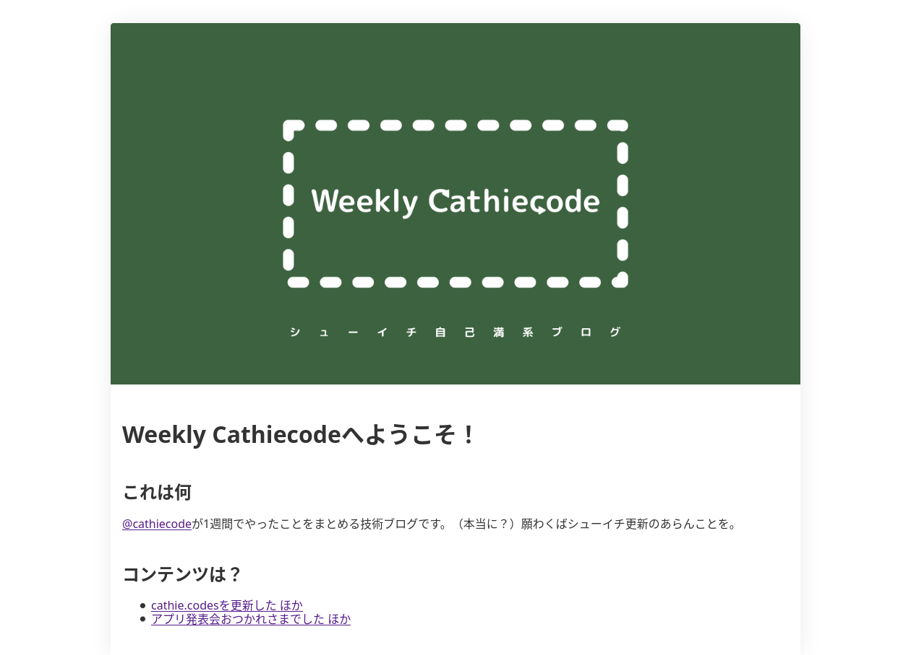

だなんて華々しいスタートを切る気は毛頭ない。ぼくの性格から言ってこんなものは持って2日だとかその辺なのだから。
ブログで何を書くかなどということも特に宣言するつもりもない。強いて言うならばお気持ち表明を隔離する場所である。
あるいは、[Yourein's Desktop.ini](https://yourein.github.io/)に感化されて始めたので似た傾向になるかもしれない。ただ、面白い長文を書けるほどぼくの精神年齢は高くないのでまあそのようなものは期待しないでいただきたい。

## 反省

さて、ぼくが2021年に大学に入学してからおよそ3年と2月経過した訳だが、ブログを始めようとする試みはこれで3回目である。
最初のブログはあまり覚えていないがたぶん10記事も書かずにやめた。入学直後のことである。大学生というのは入学直後に何者かにならなければいけないという使命感じみたものに突き動かされ、たいていは恥ずかしい過去を作りがちなものである[^1] [^2]。ぼくも多分に漏れずそういったものを量産していたわけだが、件のブログはそういったもののひとつである。

最終的に投げ出した理由はよく覚えていないが、おそらく[自作のブログエンジン](https://github.com/cathiecode/weekly.cathie.codes)の機能が足りず、それを実装するのも面倒だから、といった理由だったと記憶している。
ここで得た教訓は、そういった製品の再実装は必ず失敗するということである[^3]。既製品を使うべきである。

2つ目のブログは去年あたりに作った気がするがはっきりしない。タイトルもドメインも何も思い出せない。日報をやると宣言したのは覚えているがこれは3日も持たなかったと思う。投げ出した理由は単純で、そもそも日付の区切りがあいまいな生活スタイルに日報という概念が合わなかったのである。日報を書く時には日付を書く。しかし、1日のサイクルが24時間で回っていないときにそのような行為は無意味である。そのせいでワケがわからなくなってやめたことを覚えている。ぼくは一種の完璧主義者[^4]なのでそれが崩れて更新する意味を見失ったのだ。

ここで得た教訓は、ブログで何かを書くと宣言するのはやはりぼくにとって無意味であるということである。

## 選定
さて、ここまでの反省を生かしてブログを書くプラットフォームの選定を行った。それぞれのプラットフォームがなぜ採用されなかったかを備忘録的に書いておく。

### 条件
- Markdownで書ける
- シンプルなデザイン
- できるだけコードを書かない
- ひっそりとした場所である(できるだけ見つからない)
- 維持の手間がかからない

### ブログサービス
#### はてなブログ
かなりいい線を行っているがお天道様に見せられないような内容を書きたいのでできるだけ見えないところがよかった。不採用。

#### Tumbr
なんか鼻につくので不採用。

#### さまざまな国内ブログサービス
Markdownが書けない。ありえん。

### ソフトウェア
#### Wordpress
Markdownを書けるらしいけどセルフホストはだるいし[Wordpress.com](https://wordpress.com/)はかねがかかる。不採用。

#### Jekyll
よさそうだけどRubyアレルギーなのでむり。不採用。

#### Hugo
かるそうではやそうでテーマが充実してる。採用。

#### 自作
やらないほうがよい。

そういうことでHugoを採用した。テーマは[Stack](https://github.com/CaiJimmy/hugo-theme-stack)。だいたいの機能は足りると思う。

## 不満点
- Headdingがちょっとうるさい
- フォントがちょっとやだ
  - [ここ](https://ics.media/entry/200317/)と[ここ](https://stack.jimmycai.com/config/header-footer#example-custom-font-family-for-article-content)を参考にして無理やり変えた
  - なんか言語を指定してもzh用のフォントが適用されてる なんで？
- 正直なんで動いてるのかよくわからない

ここから先、1日に何回も更新するかもしれないし、1年全く更新しないといった可能性もある。まあ、そんな感じで。

[^1]: 春にそういった人々をTwitterで眺めるのがぼくのちょっとした悪趣味である
[^2]: このブログを始めるという試みもその延長線上にあるのかもしれない
[^3]: これについてもそのうちお気持ち表明する予定である。
[^4]: “こだわりが強い”という点において
