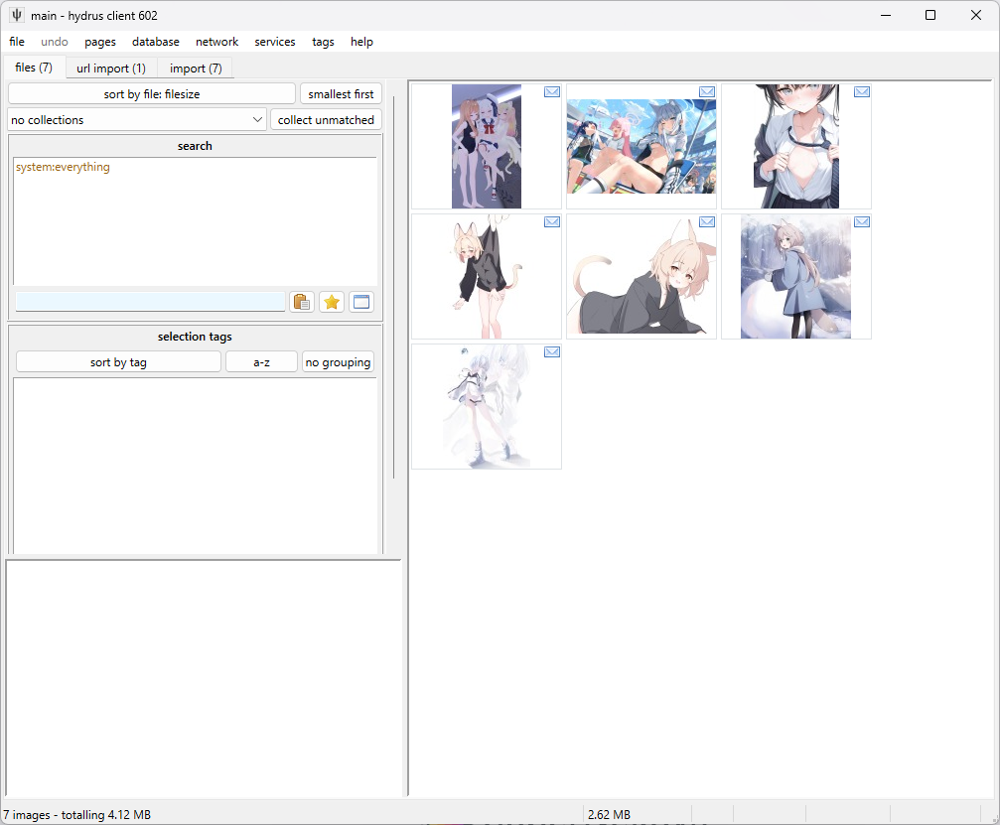
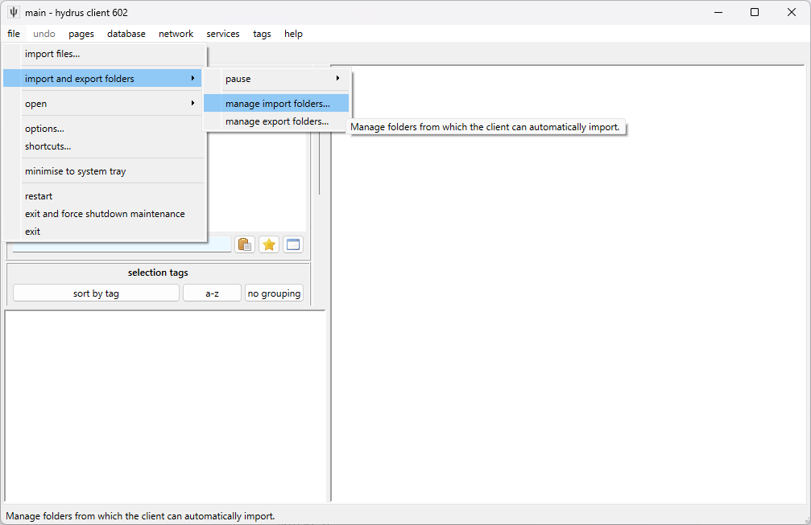
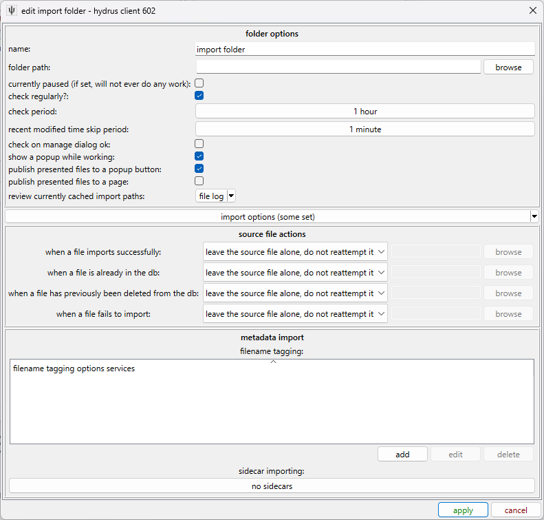
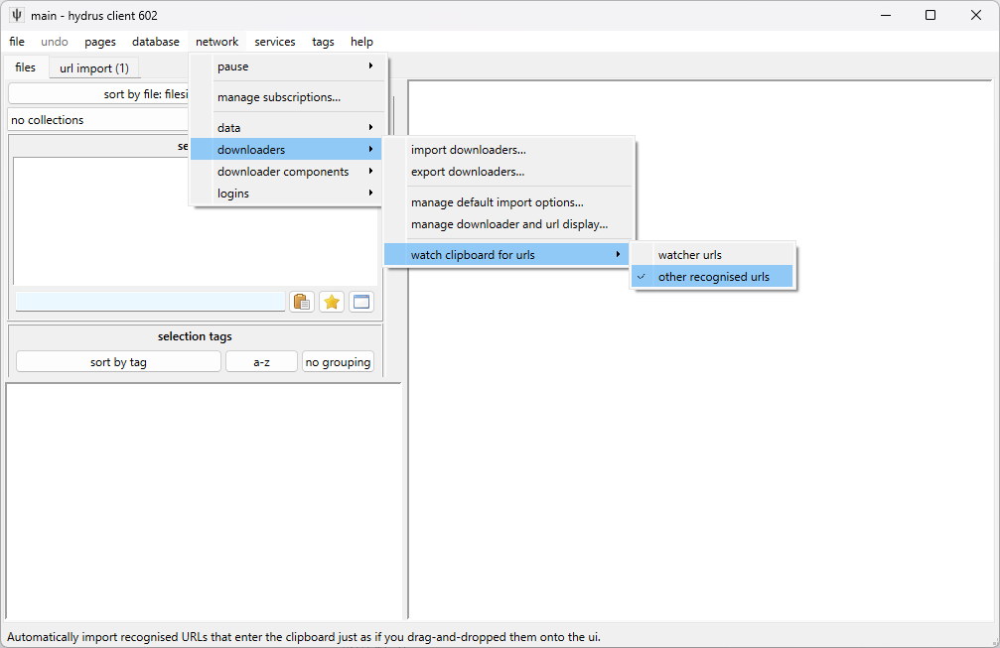
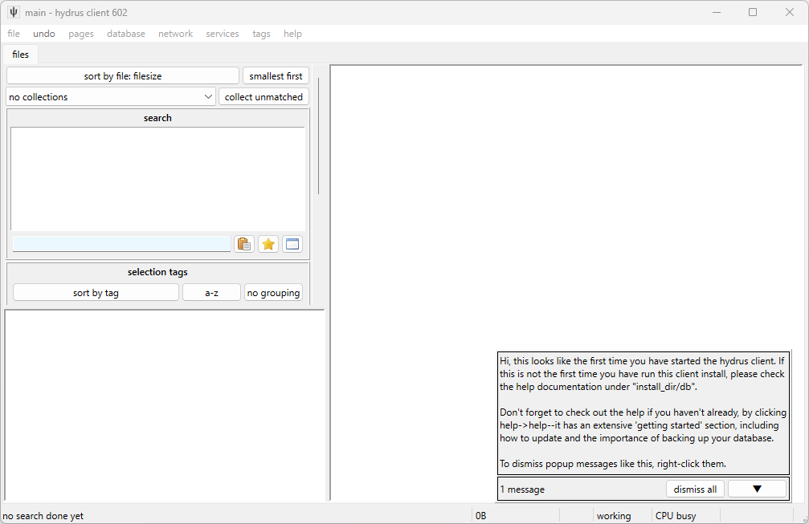

## 要旨
インターネット上に存在するイラストレーションは日々増え続けており、その数は膨大である。しかし、それらのイラストは必ずしも永続的に公開されているわけではなく、プラットフォームによるモデレーションや公開者の都合により削除されることがある。特に自分が気に入っているイラストが消えてしまう場合の損失は大きい。それを防ぐためオタクは自分のPCにイラストを保存しておくことが一般的であるが、その数が多くなると管理が難しくなる。筆者らはHydrus Networkを使用し収集したイラストを管理することで、効率的にイラストを保存・管理する方法を提案する。

## 背景
オンライン上の情報は永続的に保存されているわけではなく、情報は削除・修正されることが多い[1]。それはイラストレーションも同様であり、自分が気に入っているイラストが消えてしま~~ったり修正が強くなった状態で再公開されてしま~~うことがある。そのため、オタクは自分のコンピュータにイラストを保存しておくことが推奨される。これを単にローカルのフォルダに保存している場合、ファイルの重複や同ファイル名による上書きなどが発生する。そこで、ファイル管理ソフトウェアを使用する必要性が生じるが、一般のファイル管理ソフトウェアはイラストの管理には向いていない。また、遠隔地からのアクセスには対応していないことも多い。そこで、本稿では保存したイラストレーションの管理に適した管理ソフトウェアを選定し、オタクの使用方法に沿った構築方法を提案する。

## 選定
飽きたので論文調をやめます。イラストの管理に使用できるソフトウェアはいくつかありますが、オタクのユースケースにあったソフトウェアはそこまでありません。そこで、選定基準をいくつか示したうえでHydrus Networkが適している理由を述べます。

### 選定基準
- クラウドでない(いつ消されるかわかったものじゃないので)
- リモートからイラストを見ることができる(スマートフォンから見たいよね)
- タグ付けができる
- 重複排除がある
- エコシステムが整備されている(プラグインなど)
- APIがある(オタクなのでいろいろ拡張したい)

### 見つかったもの
- NextCloud
  - 試したけど重いのでやめた
- PhotoPrism
  - エコシステムが微妙
  - AIタギングがビルトインだが、イラスト向けじゃない
- Hydrus Network
  - よさそう
- Danbooru(ソフトウェア)
  - セルフホストが辛い

### Hydrus Network

[Hydrus Network](https://hydrusnetwork.github.io/hydrus/)は、匿名の開発者によって開発されている画像整理ソフトウェアです。非常に強力なタグシステムと様々なプラットフォームに対応したダウンロードツールが標準でついてきて、ローカルに画像を保存したいオタクにはもってこいです。また、Hydrus Webという別クライアントによりHTTP経由でのアクセスも可能です。

## 実際に やってみた
### 環境構築(ローカルに保存する場合)
1. [Githubのリリースページ](https://github.com/hydrusnetwork/hydrus/releases)から最新のバージョンをダウンロードしてきます。
1. インストーラを実行します。
1. 以上。

#### 常駐させる
1. メニューバーのfile > optionsを選択する。
1. 左のメニューからsystem trayを選択する。
1. すべてのチェックボックスをオンにする。

### 環境構築(NASなどに構築してスマートフォンなどで見たい場合)
説明が面倒なので自宅で使用している`compose.yml`を公開します。オンライン上に公開するのはセキュリティ的によくなさそうなのでCloudflare Accessなどで保護するといいかと思います。[Hydrus AIO](https://github.com/cathiecode/hydrus-aio/)

適当にファイルパスを変えて使ってください。AIで勝手にDanbooruっぽいタグをつけるデーモンも同梱されています。

### 使い方
Hydrusはインポートされた画像のみを取り扱います。(コンピュータ上にあるファイルをすべてインデックスするような動きはしない。)そのため、使い始めるには保存したファイルをインポートする必要があります。
インポートは画像をドラッグ&ドロップすることによってもできますが、これは利便性が低いので自動でファイルをインポートする設定があります。

#### 特定のフォルダに入れた画像を監視してインポートする
1. file > import and export folders > manage import folders...を選択
    
1. folder pathのbrowseを選択して監視したいフォルダを選択する
    
1. check period(監視間隔)をお好みで選択する
1. recend modified time skip periodを10minくらいに選択する(これをやらないとダウンロード途中のファイルをインポートしようとしてファイルが壊れることがある)
1. source file actionsはお好みで

#### クリップボードのURLを自動でダウンロードしてインポートする
1. メニューバーのnetwork > downloaders > watch clipboard for urls > other recognised urlsを選択する。
    
1. pixivなどのURLをコピーする

#### 閲覧
Hydrusは大量のファイルを管理することを目的としているため、検索クエリを発行しないかぎりなにも表示されません。このような挙動に加え、Hydrusは他のソフトウェアに比べて非直感的なインタフェースを備えています。慣れれば楽になるので、emacsやviのようなものだと思って下さい。ここでは軽く使用方法を説明するにとどめて、他の使い方は触りながら慣れてもらおうと思います。

左の検索ボックスに`system`と入力すると、さまざまなsystem predicates(システムタグ)がサジェストされます。導入した直後ではそんなに多くのファイルはないでしょうから、ためしにすべてのファイルを表示してみましょう。`system:everything`をダブルクリックするとクエリ(predicate)のリストに追加され、全ての画像が表示されます。クエリの`system:everything`をダブルクリックするとそのpredicateは削除されます。

ひとつもpredicateがない場合はなにも表示されません。不親切ですね！でも、慣れると超強力なインタフェースにより自由に画像を管理することができます。

インポートされたファイルはinboxというところに入り、その段階でタグを編集してからarchiveするのが本式なのですが、別にやらなくても困らないのでここでは説明しません。

## まとめ
本稿では、Hydrus Networkを使用して画像をインポートし、閲覧する方法の説明をしました。正直とっつきにくいソフトウェアではありますが、慣れると超強力なツールになります。みなさんもぜひHydrus Networkを使用して快適な図書館生活を送ってください。

## おまけ
### Hydrus Networkはなぜ「Network」なのか？
そもそもHydrusはP2P型分散ネットワークを意図して設計されているようで、ファイルハッシュからタグ付けを共有する機能があるようです。(ほかにもなにかできるのかな)[標準では「ネットワーク」に接続することはない](https://hydrusnetwork.github.io/hydrus/access_keys.html#first_off)ようですが、一応念頭において使ったほうがよさそうです。

### この記事について
この記事は[あらた界隈とそのまわりとそのまわりとそのまわり 訳: だれでも参加可能 なアドカレ 2024 ドキッ!？オタクだらけのアドベントカレンダー(完走するとは言っていない)](https://adventar.org/calendars/10239)の9日目の記事ですが、公開日は19日目です。

本当はP2HACKS2024について書くべきでしょうが、気がついたら会期後の日程が全部埋まっていたので(まじかよ)最近やってたことについて書くことにしました。

10日目の記事はたつお先生の[今年買ってよかったもの](https://sizu.me/t4t5u0/posts/r2t4e3kzx4f1)です。

…このウェブサイトまだ動くことあったんだ

## 参考文献
[1]: OCLC Online Computer Library Center, Inc., Office of
Research. ìOCLCís Web characterization projectî.
(online), available from <http://wcp.oclc.org/>,
(accessed 2024-05-08).

[2]: hydrus network. hydrus network. (online), available from <https://hydrusnetwork.github.io/hydrus/>, (accessed 2024-05-08).
